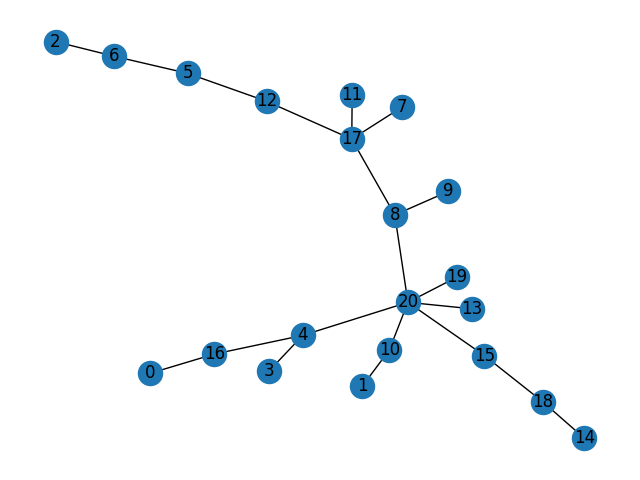

# TP INFO 704
[Sujet du TP](https://www.lama.univ-savoie.fr/pagesmembres/tavenas/Materiel_online/tp.pdf)

***Liens utiles :*** 
[Algorithme de Kruskal](https://www.wikiwand.com/fr/Algorithme_de_Kruskal) 
[Union-find](https://www.wikiwand.com/fr/Union-find) 

## Premier algorithme d'approximation
1. Avec mon algorithme (fait à partir du pseudo-algo de wikipedia) j'obtiens des graphs comme vous pouvez le voir ci-dessous.
##### Voici les grpahs créés à partir des arêtes triées : (voir [main.py](./main.py)) 

##### Voici les graphs créés à partir des liens parents-enfants

Les cycles obtenus sont :
`[9, 0, 7, 3, 6, 10, 4, 5, 2, 1, 8, 9]` pour le fichier Cities10\n
`[9, 8, 20, 19, 10, 1, 15, 18, 14, 13, 4, 16, 0, 3, 17, 12, 5, 6, 2, 11, 7, 9]` pour le fichier Cities20

2. Cette implémentation est de complexité O(n log n)
